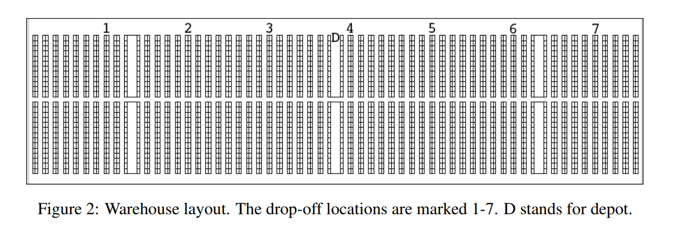

# Warehouse Optimization

#  topics to discuss

1) abandon VNS in favor of an addition to the model? my interpretation of savings algo
2) simple routing heuristic (our orders do not have own unique drop-off locations)

3) ALNS: What does greedy heuristc mean? (p.16) used in heuristic 4; currently I predict execution time for every batch for all pickers and assign the respective fastest picker (very slow); 
4) less batching (and routing), more modeling?
5) shrinkage effect for random effects
6) Matuisiak et al: "To still allow
a comparison, virtual days are constructed by partitioning the data of 24,669 batches into 12 (about)
equally sized subsets. Each partition forms one virtual day, resulting in approximately 2056 orders (685
batches) per day." distinction between *order lines* and *orders*?
7) ALNS: score for predicted total batch execution times per picker. right now: algorithm runs until batches are distributed among 2-4 best pickers but maximum execution time limit per picker is not upheld; what happens when a picker's time limit is exceeded? Matusiak et al: "The total execution time of all the batches executed by a picker should not exceed the
maximum threshold time M_max. If adding a batch were to exceed this threshold, it would be discarded"
for this picker."

# tbd

* ALNS: heuristics 1 + 2; hopefully 1.) fixes the others
* ...
